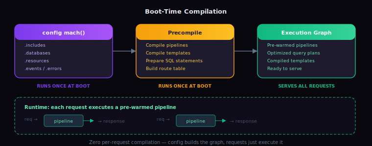
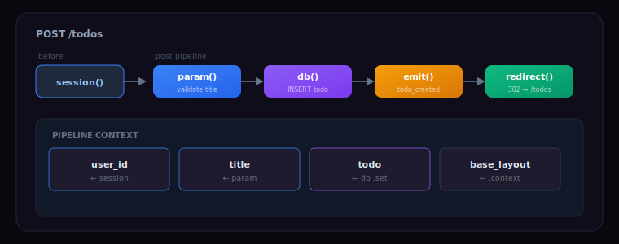
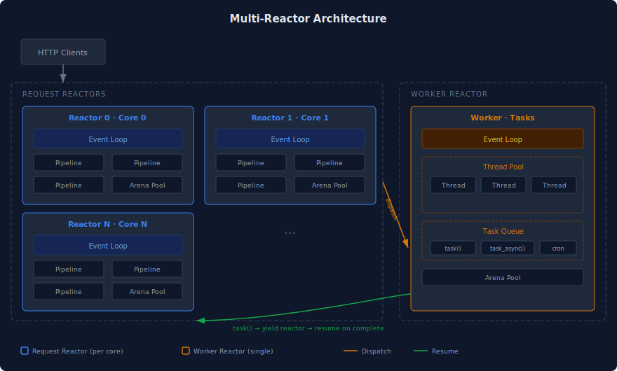
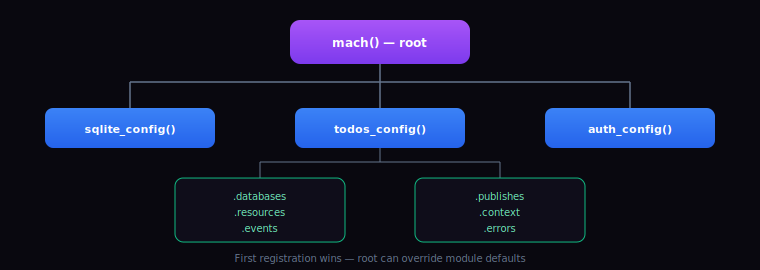
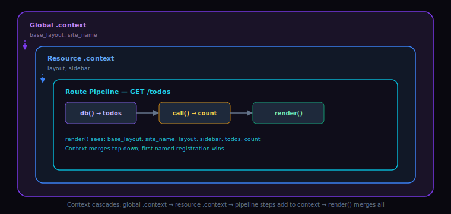
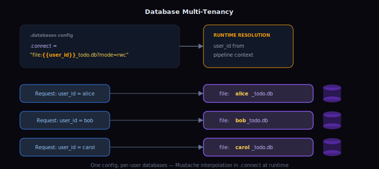
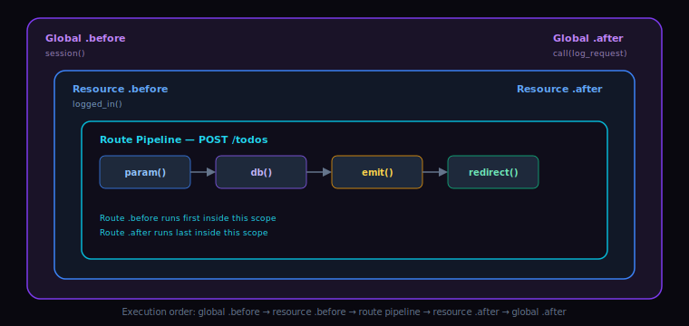
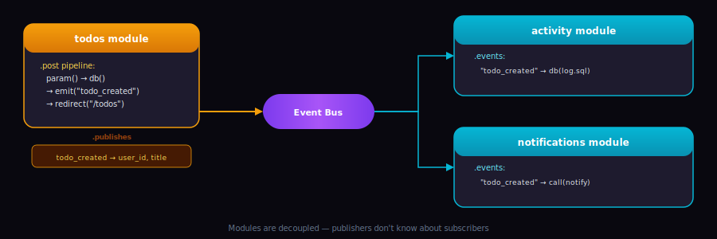
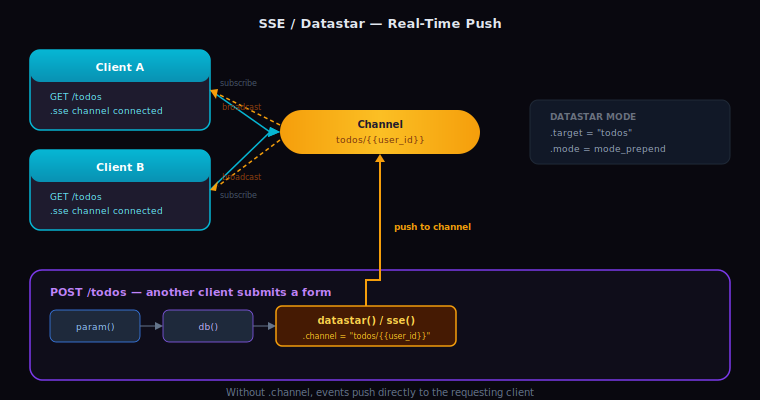

# MACH

## Why MACH

Modern Asynchronous C Hypermedia (MACH) delivers C's bare-metal performance through a high-level, declarative API. Your config compiles directly into an optimized execution graph at boot, with no runtime indirection and no framework overhead.

* **Zero Boilerplate:** No build scripts, package managers, or ORMs. Your app compiles and hot-reloads automatically.
* **Safe by Default:** The runtime handles memory with arena allocators, plus concurrency and async I/O. Never call `malloc` or `free`. All database queries use prepared statements. All pipeline steps emit OpenTelemetry spans automatically.
* **Batteries Included:** Built-in modules for Datastar, HTMX, SQLite, Postgres, MySQL, Redis, Valkey, DuckDB, auth, SSE, and UI. Native multi-tenant database support with LRU connection pooling.

---

## Table of Contents
* [Quick Start](#quick-start)
* [Philosophy](#philosophy)
* [How It Works](#how-it-works)
* [Building with MACH](#building-with-mach)
* [Tooling](#tooling)
* [API Reference](#api-reference)
* [Module API Reference](#module-api-reference)
* [License](#license)

---

## Quick Start

Everything runs in Docker, no other local dependencies needed.

```bash
mkdir myapp && cd myapp
wget https://docker.nightshadecoder.dev/mach/compose.yml

# Dev server on :3000, telemetry on :4000
# Includes file watching, auto compilation, hot code reloading, HMR
docker compose up
```

Attach to the TUI with `docker compose attach mach`

The containerized environment includes a TUI editor with AI, LSP, and console.
You can also use your own editor. MACH watches the project directory.

Create `main.c` with the example below to see hot-reloading in action.

### Hello World

```c
#include <mach.h>
#include <sqlite.h>

// returns the app configuration, runs once at boot
config mach(){
  return (config) {
    // {{}} defines an array of resources
    .resources = {{
      {"greeting", "/",
        // pipeline: query the db, then render the result
        .get = {{
          // single query uses double braces (struct > query)
          query((d){
            .set = "greeting",
            .db = "hello_db",
              "select name "
              "from greetings "
              "limit 1;"
          }),
          // mustache template using "greeting" from context
          render((r){
            "<html>"
              "<body>"
                "{{#greeting}}"
                  "<p>Hello {{name}}</p>"
                "{{/greeting}}"
              "</body>"
            "</html>"
          })
        }}
      }
    }},

    .databases = {{
      .engine = sqlite_db,
      .name = "hello_db",
      .connect = "file:hello.db?mode=rwc",
      .migrations = {
        "CREATE TABLE greetings ("
          "id INTEGER PRIMARY KEY AUTOINCREMENT,"
          "name TEXT NOT NULL"
        ");"
      },
      .seeds = {
        "INSERT INTO greetings(name)"
        "VALUES('World');"
      }
    }},

    .modules = {sqlite}
  };
}
```

---

## Philosophy

Applications are data transformations: input from sources, business logic, output to the client. MACH keeps each piece standard. Data comes from raw SQL, not ORMs. Business logic is plain C functions, not object hierarchies. Output is standard HTML, CSS, JS, using standard Mustache templates. These pieces compose inside pipelines: ordered lists of steps that transform a request into a response.

Tooling is equally standard: lldb for debugging, Playwright and Criterion for testing, OpenTelemetry for observability. All built in, nothing to configure.

### IDEAL Philosophy
MACH's design philosophy rejects object-oriented complexity in favor of data-oriented principles. Where SOLID guides OOP abstraction, IDEAL guides data and behavior composition.

* **Interfaces are Deep:** Few functions that do a lot. `query()` handles queries, prepared statements, concurrency, and error triggering behind a single step.
* **Domain Centered:** Each module owns exactly one domain: its data schema, migrations, and behavior. A `todos` module defines its own tables, seeds, and resources.
* **Encapsulated:** Internal mechanics remain private, but data is transparent and inspectable. Pipeline context is always readable; module internals are not.
* **Autonomous:** Modules are fully self-contained. A module carries its own schemas, migrations, seeds, and event contracts. Drop it in, it works.
* **Local:** All related code is co-located. A module's SQL, templates, and handlers live together, following data locality not class inheritance.

---

## How It Works

### Data-Oriented Pipelines
The `mach()` function runs once at boot. Its returned `config` is processed into an optimized execution graph with precompiled pipelines, queries, and templates. Each incoming request then executes its matching pipeline as a sequence of pre-warmed steps.





### Multi-Reactor Architecture
Each CPU core runs an independent reactor event loop. Async boundaries are handled between steps, scaling across cores without threads or locks in application code.



### Memory Management
Each reactor maintains a pool of arena allocators. When a request arrives, the pipeline is assigned an arena from the pool. All allocations during that pipeline draw from the arena. When the pipeline completes, the entire arena is freed at once. No per-object cleanup, no garbage collection, no manual memory management in application code.

### String Interpolation
All strings in MACH are interpolatable. Anywhere you see a `string` field — SQL queries, `.connect`, `.channel`, `.url`, `.data`, `format()` — you can use `{{context_key}}` to reference values from the pipeline context. In `query()` and `find()` steps, interpolated values are bound as prepared statement parameters, not string-concatenated.

---

## Building with MACH
* [Notation](#notation)
* [App Composition](#app-composition)
* [Context](#context)
* [Databases](#databases)
* [Static Files](#static-files)
* [Middleware Pipelines](#middleware-pipelines)
* [Resource Pipelines](#resource-pipelines)
* [Error Pipelines](#error-pipelines)
* [Event Pipelines](#event-pipelines)
* [Pipeline Steps](#pipeline-steps)

### Notation
Each pipeline step takes a compound literal of its step config type: `d` for find/query, `da` for find_all/query_all, `r` for render, `v` for validate, `c` for custom, `s` for sse, `e` for emit, `u` for redirect/reroute, `j` for join, `n` for nest, and `ds` for ds_sse. So `query((d){...})` passes a `d` config to the `query` step.

MACH's declarative syntax uses C's designated initializer braces at different depths:

* **Single `{}`** — a single value or struct.
* **Double `{{}}`** — an array of items: pipelines, URLs, context entries, concurrent queries in `find_all()`/`query_all()`, etc.
* **`(asset){ #embed "file" }`** — the `asset` type bakes a file directly into the compiled binary using standard C `#embed`. Used for templates, SQL files, and other static content.

```c
// {{}} wraps an array of pipeline steps
.get = {{
  // single query: just a struct literal
  query((d){
    .set = "todos",
    .db = "todos_db",
    "select * from todos;"
  }),
  // multiple queries run concurrently via query_all
  query_all((da){{
    {
      .set = "projects",
      .db = "projects_db",
      "select * from projects;"
    },
    {
      .set = "tags",
      .db = "todos_db",
      "select * from tags;"
    }
  }}),
  // {} wraps a single value
  render((r){(asset){
    #embed "todos.mustache.html"
  }})
}}
```

### App Composition
Every app entry point or module returns a `config` struct. Compose your app by adding modules to `.modules`. Configurations merge top-down: anything named resolves to the first registration, so root configurations can override module defaults. The `.name` property gives your application or module its identifier.



```c
#include <mach.h>
#include <sqlite.h>
#include "todos/todos.c"

config mach() {
  return (config) {
    .name = "app",

    // Include the core framework and your custom modules
    .modules = { sqlite, todos }
  };
}
```

### Context
The `.context` block injects variables and assets like templates and queries into the pipeline context. Values like site names or HTML layouts become available to templates without passing them manually on every request. Use standard C `#embed` to bake files directly into the compiled binary via the `asset` type.



```c
config mach() {
  return (config) {
    // Define static assets and global lookup variables
    .context = {
      {"base_layout", (asset){
        #embed "layout.mustache.html"
      }}
    }
  };
}
```

### Databases
Each module owns its schema and migrations. When `.migrations` or `.seeds` are provided, MACH tracks them in a `mach_meta` table. Migrations are forward-only and index-based: they run in array order, each migration is applied once, and applied migrations cannot be modified. New migrations are appended to the end of the array. Seeds are idempotent and safe to re-run across deployments.

All engines follow the same configuration pattern. Set `.engine` to the appropriate constant: `sqlite_db`, `postgres_db`, `mysql_db`, `redis_db`, `valkey_db`, or `duckdb_db`.

Multi-tenant databases work through interpolation in the `.connect` string. The interpolated value can be a user, organization, team, or any other scope. Connections are pooled with LRU eviction, so active tenants stay warm and idle connections get reclaimed.



```c
config todos() {
  return (config) {
    // Define databases natively within the module config
    .databases = {{
      .engine = sqlite_db,
      .name = "todos_db",
      .connect = "file:{{tenant_id}}_todo.db?mode=rwc",
      .migrations = {(asset){
        #embed "create_todos_table.sql"
      }},
      .seeds = {(asset){
        #embed "seed_todos_table.sql"
      }}
    }}
  };
}
```

### Static Files
Create a `public` directory in your project root. Any files placed there are served directly. Use it for images, fonts, pre-built CSS/JS, and other assets that don't need to be compiled into the binary.

### Middleware Pipelines
Middleware pipelines (`.before` and `.after`) execute at the boundaries of the request lifecycle. They chain top-down across all scopes. You can define global middleware at the root config, or scope it locally to specific resources or events.



```c
#include <mach.h>
#include <session_auth.h>

config mach() {
  return (config) {
    // session_auth provides the session() pipeline step
    .modules = { session_auth },

    // Execute before every resource pipeline in the app
    .before = { session() },

    // Execute after every resource pipeline in the app
    .after = { custom((c){ log_request }) }
  };
}
```

### Resource Pipelines
MACH is resource-based, not route-based. Each entry in `.resources` defines a named resource at a URL with its supported HTTP verbs (`.get`, `.post`, `.delete`, `.sse`, etc.) and localized middleware. The first positional field is the resource `.name`, used by `redirect()`, `reroute()`, and the `{{url:name}}` template helper to reference the resource without hard-coding URL paths. Clients select the verb through the request method, or by passing `http_method` as a query parameter, hidden form field, or any other mechanism that places it in the pipeline context. For example, `GET /todos` hits `.get`, `POST /todos` hits `.post`, and `/todos?http_method=sse` connects to the SSE stream. Pipelines are data-oriented arrays of execution steps. Validate parameters, execute concurrent SQL, and render templates in one sequence. File uploads are available in the pipeline context like any other request parameter.

```c
config todos() {
  return (config) {
    // Define the resources and execution pipelines
    .resources = {{
      { "todos", "/todos",
        .post = {{
          validate((v){
            .name = "title",
            .validation = "^\\S{1,16}$",
            .message = "1-16 chars, no spaces"
          }),
          query((d){
            .db = "todos_db",
            (asset){
              #embed "create_todo.sql"
            }
          }),
          emit((e){"todo_created"}),
          redirect((u){"todos"})
        }},

        .before = { logged_in() }
      }}
    }
  };
}
```

### Error Pipelines
Errors resolve bottom-up, the opposite of middleware. If a step fails, MACH looks for an error pipeline matching the HTTP status code. It walks from the resource URL, to the resource block, to the module, to root, stopping at the first match.

For example, if a `validate()` step fails validation, a `400 Bad Request` is triggered. If a `find()` step returns no rows, a `404 Not Found` is triggered. Unhandled errors surface in the TUI console and telemetry UI.


```c
config mach() {
  return (config) {
    // Define global error catch-alls at the root config
    .errors = {
      { http_bad_request, {
        { render((r){(asset){
          #embed "400.html"
        }})}
      }},
      { http_not_found, {
        { render((r){(asset){
          #embed "404.html"
        }})}
      }}
    }
  };
}
```

### Event Pipelines
Modules communicate through pub/sub event contracts. A pipeline triggers an internal event with `emit()` and declares its intent in `.publishes`. The `.with` field lists context values that are read from the emitter's pipeline context and set in the subscriber's pipeline context when the event fires. Other modules react by defining pipelines in their `.events` array.



```c
// In todos() (todos.c)
config todos() {
  return (config) {
    .name = "todos",

    // The todos module broadcasts a state change
    .publishes = {
      {"todo_created", .with = {"user_id", "title"}}
    }
  };
}

// In activity() (activity.c)
config activity() {
  return (config) {
    .name = "activity",

    // The independent activity module listens and reacts
    .events = {
      {"todo_created", {{
        query((d){
          .db = "activity_db",
          (asset){
            #embed "log.sql" }
        })
      }}}
    }
  };
}
```

### Pipeline Steps

Steps are the units of work in a pipeline. Each step receives the current request context, acts on it, and passes control to the next step.

* [validate](#validate)
* [find & query](#find--query)
* [find_all & query_all](#find_all--query_all)
* [join](#join)
* [custom](#custom)
* [emit](#emit)
* [sse](#sse)
* [ds_sse](#ds_sse)
* [render](#render)
* [redirect & reroute](#redirect--reroute)
* [nest](#nest)
* [if_context](#if_context)

#### validate

`validate()` validates a request parameter (query string, form body, or URL parameter). If validation fails, it triggers a `400 Bad Request` error, which resolves through the nearest error pipeline.

Validate a required parameter with a regex pattern:

```c
.post = {{
  validate((v){
    .name = "title",
    .validation = "^\\S{1,16}$",
    .message = "must be 1-16 characters, no spaces"
  }),
  // title passed validation, pipeline continues
}}
```

Mark a parameter as optional with `.optional` so it won't trigger an error when absent. Use `.fallback` to provide a default value:

```c
.get = {{
  validate((v){
    .name = "page",
    .optional = true,
    .fallback = "1",
    .validation = "^\\d{1,4}$",
    .message = "must be a number"
  }),
  // page is always in context: either the request value or "1"
}}
```

URL parameters like `:id` in `/todos/:id` are also validated with `validate()`:

```c
{"todo", "/todos/:id",
  .before = {
    validate((v){
      .name = "id",
      .validation = "^\\d{1,10}$",
      .message = "must be a number"
    })
  }
}
```

#### find & query

`find()` and `query()` each execute a single database query. Both specify `.db` for the database name, with the SQL string as a positional field. Use `.set` to store the results in the pipeline context under a name. All queries use prepared statements. Interpolations like `{{user_id}}` are bound as parameters, not string-concatenated.

The difference: `query()` runs the SQL as-is, while `find()` runs the SQL but triggers a `404 Not Found` if no rows are returned.

Fetch a collection and store it in context:

```c
.get = {{
  query((d){
    .set = "todos",
    .db = "todos_db",
    (asset){
      #embed "get_todos.sql"
    }
  }),
  // todos is now in context
  render((r){(asset){
    #embed "todos.mustache.html"
  }})
}}
```

Fetch a single record with `find()`, which auto-triggers 404 if it doesn't exist:

```c
.get = {{
  find((d){
    .set = "todo",
    .db = "todos_db",
    (asset){
      #embed "get_todo.sql"
    }
  }),
  // todo is guaranteed to exist here; otherwise 404 was triggered
  render((r){(asset){
    #embed "todo.mustache.html"
  }})
}}
```

Execute a query without storing results. Useful for writes where subsequent steps don't need the data:

```c
.delete = {{
  query((d){
    .db = "todos_db",
    (asset){
      #embed "delete_todo.sql"
    }
  }),
  redirect((u){"todos"})
}}
```

#### find_all & query_all

`find_all()` and `query_all()` execute multiple database queries concurrently. They take a `da` config, which wraps an array of `d` query configs. Each query runs independently on the same reactor. After the step completes, all results are available in the pipeline context. If one query fails, the remaining queries still complete and their results remain in context, so error handlers have the data available for compensating queries if they resume the pipeline.

`query_all()` runs all queries as-is. `find_all()` triggers a `404 Not Found` if any query returns no rows.

```c
.get = {{
  query_all((da){{
    {
      .set = "todos",
      .db = "todos_db",
      "select * from todos where user_id = {{user_id}};"
    },
    {
      .set = "count",
      .db = "todos_db",
      "select count(*) as total from todos where user_id = {{user_id}};"
    }
  }}),
  render((r){(asset){
    #embed "todos.mustache.html"
  }})
}}
```

For transactions, use standard SQL transaction statements directly in your queries (`BEGIN`, `COMMIT`, `ROLLBACK`).

#### join

`join()` combines two result sets already in the pipeline context. It nests records from one table into each matching record of another, like a SQL JOIN but in-memory across context tables. Useful when data comes from separate databases or queries and needs to be combined for rendering.

Specify the two tables, the fields to match on, and the name of the field where the nested records will be attached.

Fetch projects and their todos separately, then join them for rendering:

```c
.get = {{
  query_all((da){{
    {
      .set = "projects",
      .db = "projects_db",
      "select id, name from projects where user_id = {{user_id}};"
    },
    {
      .set = "todos",
      .db = "todos_db",
      "select id, title, project_id from todos where user_id = {{user_id}};"
    }
  }}),
  join((j){
    .target_table = "projects",
    .target_field = "id",
    .nested_table = "todos",
    .nested_field = "project_id",
    .target_join_field = "todos"
  }),
  render((r){(asset){
    #embed "projects.mustache.html"
  }})
}}
```

After the `join()` step, each project record contains a `todos` field with its matching todo records. The template can iterate over both levels:

```html
{{#projects}}
  <h2>{{name}}</h2>
  <ul>
    {{#todos}}
      <li>{{title}}</li>
    {{/todos}}
  </ul>
{{/projects}}
```

#### custom

`custom()` invokes a C function with access to the full pipeline context via the Imperative API. It runs synchronously on the reactor, so keep it to context manipulation and business logic. Long-running or blocking work in a `custom()` will block the reactor. Use pipeline steps or the Imperative API's response functions for I/O.

```c
.get = {{
  query((d){
    .set = "challengers",
    .db = "pokemon_db",
      "select id, name, sprite "
      "from pokemons "
      "order by random() "
      "limit 2;"
  }),
  custom((c){assign_opponents}),
  render((r){.asset = "home"})
}}
```

```c
void assign_opponents() {
  auto const t = get("challengers");
  auto const p0 = table_get(t, 0);
  auto const p1 = table_get(t, 1);
  record_set(p0, "opponent_id", record_get(p1, "id"));
  record_set(p1, "opponent_id", record_get(p0, "id"));
}
```

All values set through the Imperative API become part of the pipeline context.

To trigger an error pipeline from inside a `custom()` function, use `error_set()`. This stops the pipeline and resolves through the nearest matching error pipeline:

```c
void validate_ownership() {
  if (!has("is_owner"))
    error_set("auth", (error){
      .code = http_not_authorized,
      .message = "not the owner"
    });
}
```

#### emit

`emit()` triggers an internal pub/sub event. Other modules subscribe in their `.events` array and react independently, with no direct dependency on the emitter.

Emit an event after creating a todo:

```c
.post = {{
  validate((v){
    .name = "title",
    .validation = "^\\S{1,16}$",
    .message = "1-16 characters"
  }),
  query((d){
    .set = "todo",
    .db = "todos_db",
    (asset){
      #embed "create_todo.sql"
    }
  }),
  emit((e){"todo_created"}),
  redirect((u){"todos"})
}}
```

#### sse

`sse()` pushes a Server-Sent Event. When `.channel` is specified, the event is broadcast to all clients connected to that channel. Without `.channel`, the event is returned directly to the requesting client.



Declare an SSE channel on a resource with `.sse`. This creates a persistent streaming endpoint that clients connect to. When other pipelines push events to this channel, all connected clients receive them. Clients connect using the resource URL with the SSE verb: `new EventSource("/todos?http_method=sse")`. The optional `.steps` field defines a pipeline that runs when a client first connects.

```c
{"todos", "/todos",
  .sse = {
    .channel = "todos/{{user_id}}",
    {{
      // steps run on connect, e.g. send initial state
      query((d){
        .set = "todos",
        .db = "todos_db",
        "select * from todos where user_id = {{user_id}};"
      }),
      sse((s){
        .event = "initial",
        .data = "{{todos}}"
      })
    }}
  }
}
```

Push an event to the channel from another pipeline:

```c
.post = {{
  // ... validate and query steps ...
  sse((s){
    .channel = "todos/{{user_id}}",
    .event = "new_todo",
    .data = "{{todo}}"
  })
}}
```

The `.event` and `.data` fields map directly to the SSE protocol's `event:` and `data:` lines. The `.comment` field maps to the SSE `:` comment line.

#### ds_sse

The `datastar` module provides the `ds_sse` pipeline step that combines SSE with DOM updates. It pushes Datastar-formatted events that target specific elements on the page.

```c
.post = {{
  // ... validate and query steps ...
  ds_sse((ds){
    .target = "todos",
    .mode = mode_prepend,
    .channel = "todos/{{user_id}}",
    .elements = {.asset = "todo"}
  })
}}
```

The `.target` specifies the DOM element ID. The `.mode` controls how the rendered fragment is applied: `mode_prepend`, `mode_append`, `mode_replace`, `mode_remove`, and others. The `.elements` field renders a context asset as the HTML fragment. Like `sse()`, without `.channel` the event is returned directly to the requesting client.

#### render

`render()` outputs a Mustache template using the current pipeline context.

A simple static page using a layout defined in `.context`:

```c
.resources = {{
  {"about", "/about",
    .get = {{
      render((r){(asset){
        #embed "about.mustache.html"
      }})
    }}
  }},

  .context = {
    {"layout", (asset){
      #embed "layout.mustache.html"
    }}
  }
}

```

Where `about.mustache.html` inherits from the layout:

```html
{{< layout}}
  {{$body}}
    <p>about us</p>
  {{/body}}
{{/layout}}
```

All named values in the pipeline context are available as template variables.

Use `.asset` to reference a template by its name in `.context` instead of inlining or embedding it:

```c
render((r){.asset = "home"})
```

This renders the context entry named `"home"`, which could be defined in any `.context` block in scope.

MACH includes two template engines: Mustache (default) and MDM. Use `.engine` to select a different engine, similar to how `.engine` selects a database driver in `.databases`. Additional engines can be added as modules.

#### redirect & reroute

`redirect()` sends a `302` response to the client, causing the browser to navigate to a new URL. `reroute()` re-enters the router server-side, executing the target resource's pipeline within the same request. The client sees a redirect; it never sees a reroute. Both accept a resource name, not a URL path.

Redirect after a form submission (POST, redirect, GET):

```c
.post = {{
  validate((v){
    .name = "title",
    .validation = "^\\S{1,16}$",
    .message = "1-16 characters"
  }),
  query((d){
    .db = "todos_db",
    (asset){
      #embed "create_todo.sql"
    }
  }),
  // Client receives 302, browser navigates to the "todos" resource URL
  redirect((u){"todos"})
}}
```

Reroute to serve another resource's pipeline without a round trip:

```c
{"home", "/",
  .get = {{
    // Internally executes the "todos" resource's GET pipeline
    reroute((u){"todos"})
  }}
}
```

#### nest

`nest()` wraps a sub-pipeline as a single step. The nested pipeline's steps execute in sequence within the parent pipeline. Use it to group related steps or to reuse a common sequence of steps across multiple pipelines.

```c
.get = {{
  nest((n){{
    validate((v){
      .name = "id",
      .validation = "^\\d+$",
      .message = "must be a number"
    }),
    find((d){
      .set = "todo",
      .db = "todos_db",
      "select * from todos where id = {{id}};"
    })
  }}),
  render((r){.asset = "todo"})
}}
```

#### if_context

Any step supports `.if_context`, which names a context variable. If that variable is present in the pipeline context, the step executes. If it is absent, the step is silently skipped.

This works for any context value. `.if_context = "title"` runs the step only if a `title` form parameter was submitted, and `.if_context = "todos"` runs only if a prior `query()` stored results under that name.

In this example, `custom()` evaluates business logic and sets context values that later steps gate on:
```c
.post = {{
  find((d){
    .set = "todo",
    .db = "todos_db",
    // find() triggers 404 if no rows returned
    "select * from todos where id = {{id}};"
  }),
  custom((c){classify_todo}),
  query((d){
    .if_context = "is_urgent",
    .db = "todos_db",
    "update todos set priority = 'high' where id = {{id}};"
  }),
  emit((e){
    .event = "urgent_todo",
    .if_context = "is_urgent"
  }),
  render((r){
    .if_context = "is_urgent",
    .asset = "urgent_confirmation"
  }),
  render((r){
    .if_context = "is_normal",
    .asset = "standard_confirmation"
  })
}}

void classify_todo() {
  auto const todos = get("todo");
  auto const todo = table_get(todos, 0);
  auto const due = record_get(todo, "due_date");

  if (is_within_24h(due))
    set("is_urgent", "1");
  else
    set("is_normal", "1");
}
```

---

## Tooling

### Introspection
```bash
app_info                    # view topology
app_info resources          # list all resources
app_info pipelines          # inspect pipelines
app_info events             # view pub/sub map
app_info databases          # inspect schemas
```

### Testing
MACH includes built-in test runners for both unit and end-to-end testing. No external test framework setup required.
```bash
unit_tests                  # fast, criterion-based tests
e2e_tests                   # playwright-powered browser tests
```

### Debugging
```bash
app_debug                   # interactive debugger in the TUI
```
Built on lldb with pipeline-aware commands. Halt on individual pipeline steps, step through execution, and inspect the full pipeline context including nested tables and records.

### Deployment
```bash
app_build                   # outputs slim, optimized production Docker image
```

### Observability
Every pipeline step automatically emits OpenTelemetry spans. Logs, traces, errors, and auto-profiling are visualized on the telemetry server at port 4000. No manual instrumentation required.

### Development Environment
Built-in TUI editor with HMR, LSP support, and a topology-aware AI assistant.

---

## API Reference
* [Global Configuration](#global-configuration)
* [Resource Pipelines](#resource-pipelines-resources)
* [Event Pipelines](#event-pipelines-events)
* [Error Pipelines](#error-pipelines-errors)
* [Pipeline API](#pipeline-api)
* [Imperative API](#imperative-api)
* [Constants & Enums](#constants--enums)
* [Template Helpers](#template-helpers)

### Global Configuration
Fields marked **(positional)** are the first unnamed fields in the struct initializer. They are set by position, not with `.name =` syntax.

* **.name**: Application or module identifier (positional).
* **.modules**: Modules to compose.
* **.databases**: Data stores. Accepts `.name`, `.engine`, `.connect`, `.migrations`, and `.seeds`.
* **.publishes**: Outbound event contracts. Accepts `.event` (positional) and `.with`.
* **.events**: Collection of Event Pipelines.
* **.resources**: Collection of Resource Pipelines.
* **.before** / **.after**: Global middleware pipelines.
* **.context**: Global variables and `#embed` assets. Each entry accepts `.name` (positional) and `.value` (positional).
* **.errors**: Collection of global Error Pipelines (bottom-up fallback).

### Resource Pipelines (`.resources`)
* **.urls** (positional): Collection of resource URLs. Each entry accepts `.name` (positional), `.url` (positional), `.mime` (sets the default response content type for the resource; defaults to `mime_html`, can be overridden per-response by `.mime_type` in a `render()` step), `.get`, `.post`, `.put`, `.patch`, `.delete`, `.before`, `.after`, `.context`, `.errors`, and `.sse` (which accepts `.channel` and `.steps` (positional)).
* **.before** / **.after**: Shared middleware for all URLs in the block.
* **.context**: Shared context for all URLs in the block.
* **.errors**: Collection of shared Error Pipelines for all URLs in the block.

### Event Pipelines (`.events`)
Reacts to internal pub/sub events triggered by `emit()`. Each entry accepts `.event` (positional), `.steps` (positional), `.before`, `.after`, `.context`, and `.errors`.

### Error Pipelines (`.errors`)
Catches and resolves HTTP errors or thrown exceptions. Each entry accepts `.error_code` (positional), `.steps` (positional), `.before`, `.after`, and `.context`.

### Pipeline API
All pipeline steps accept a single positional field unless additional named fields are listed.

* **validate(v)**: Validates request parameters. Accepts `.name`, `.optional`, `.fallback`, `.validation`, `.message`, and `.if_context`.
* **find(d)**: Executes a single DB query; triggers `404 Not Found` if no rows are returned. Accepts `.db`, `.set`, SQL string (positional), and `.if_context`.
* **query(d)**: Executes a single DB query. Accepts `.db`, `.set`, SQL string (positional), and `.if_context`.
* **find_all(da)**: Executes concurrent DB queries; triggers `404 Not Found` if any query returns no rows. Wraps an array of `d` query configs.
* **query_all(da)**: Executes concurrent DB queries. Wraps an array of `d` query configs.
* **join(j)**: Nests records from one context table into another by matching fields. Accepts `.target_table`, `.target_field`, `.nested_table`, `.nested_field`, `.target_join_field`, and `.if_context`.
* **render(r)**: Outputs templates. Accepts `.template` (positional). Optionally accepts `.mime_type`, `.engine`, `.asset`, and `.if_context`.
* **sse(s)**: Pushes SSE data. Accepts `.channel`, `.event`, `.comment`, `.data`, and `.if_context`.
* **custom(c)**: Invokes a custom imperative C function. Accepts `.call` (positional) and `.if_context`.
* **emit(e)**: Triggers an internal pub/sub event. Accepts `.event` (positional) and `.if_context`.
* **nest(n)**: Wraps a sub-pipeline as a single step. Accepts `.steps` (positional).
* **reroute(u)**: Re-enters the router server-side, executing the target resource's pipeline. Accepts `.resource` (positional) and `.if_context`.
* **redirect(u)**: Performs a client-side 302 redirect. Accepts `.resource` (positional) and `.if_context`.

### Imperative API
Available inside `custom()` for custom logic. All types are defined in `mach.h`.

* **Context**: `void* get(string name)`, `void set(string name, void* value)`, `bool has(string name)`.
* **Memory/Strings**: `void* allocate(int bytes)`, `void defer_free(void* ptr)`, `string format(string format_string)`. `defer_free` schedules a pointer for cleanup when the arena is released; use it for memory allocated by third-party libraries outside the arena. `format` interpolates `{{context_key}}` placeholders against the current pipeline context.
* **Response**: `void headers_set(string name, string value)`, `void cookies_set(string name, string value)`.
* **Errors**: `void error_set(string name, error)`, `error error_get(string name)`. The `error` type has `.code` and `.message`.
* **Data (Tables)**: `table table_new()`, `int table_count(table)`, `void table_add(table, record)`, `void table_remove(table, record)`, `void table_remove_at(table, int index)`, `record table_get(table, int index)`.
* **Joins**: `void table_join(j)`. Accepts `.target_table`, `.target_field`, `.nested_table`, `.nested_field`, and `.target_join_field`.
* **Data (Records)**: `record record_new()`, `void record_set(record, string name, string value)`, `string record_get(record, string name)`, `void record_remove(record, string name)`.

### Constants & Enums
* **MIME Types**: `mime_html`, `mime_txt`, `mime_sse`, `mime_json`, `mime_js`.
* **HTTP Statuses**: `http_ok` (200), `http_created` (201), `http_redirect` (302), `http_bad_request` (400), `http_not_authorized` (401), `http_not_found` (404), `http_error` (500).

### Template Helpers
In addition to standard Mustache interpolation (`{{field}}`), MACH templates support built-in helpers:

* **`{{url:resource_name}}`** — resolves a named resource to its URL path. Pass URL parameters as additional colon-separated arguments: `{{url:todo:id}}` resolves to the URL for the `todo` resource, substituting the current value of `id` into the URL pattern (e.g. `/todos/42`).
* **`{{asset:filename}}`** — resolves to the path for a file in the `public` directory with a content-based checksum appended to the filename for cache-busting. The corresponding response is served with immutable, cache-forever headers. Use it in `src`, `href`, or anywhere a static asset URL is needed: `{{asset:favicon.png}}`.
* **`{{raw:field}}`** — outputs the value of `field` without HTML escaping. Use when the context value contains trusted HTML that should be rendered as-is.
* **`{{precision:field:N}}`** — rounds a float-type string to `N` decimal places. `{{precision:price:2}}` renders `"3.14159"` as `"3.14"`.

---

## Module API Reference

Add a module's initializer function to `.modules` to use its API.

### SQLite (`sqlite.h`)
* **Initializer**: `sqlite()`.
* **Engine Constant**: `sqlite_db`. Pass as the `.engine` value in a `.databases` entry.

### Postgres (`postgres.h`)
* **Initializer**: `postgres()`.
* **Engine Constant**: `postgres_db`.

### MySQL (`mysql.h`)
* **Initializer**: `mysql()`.
* **Engine Constant**: `mysql_db`.

### Redis (`redis.h`)
* **Initializer**: `redis()`.
* **Engine Constant**: `redis_db`.

### Valkey (`valkey.h`)
* **Initializer**: `valkey()`.
* **Engine Constant**: `valkey_db`.

### DuckDB (`duckdb.h`)
* **Initializer**: `duckdb()`.
* **Engine Constant**: `duckdb_db`.

### HTMX (`htmx.h`)
* **Initializer**: `htmx()`.
* **Template Partial**: `{{> htmx_script}}`.
* **Imperative API**: `is_htmx()` returns `bool`.

### Datastar (`datastar.h`)
* **Initializer**: `datastar()`.
* **Template Partial**: `{{> datastar_script}}`.
* **Pipeline Step**: `ds_sse(ds)`. Accepts `.channel`, `.mode`, `.target`, `.elements`, `.signals`, `.js`, and `.if_context`.
* **Imperative API**: `is_ds()` returns `bool`, `respond_ds_sse(ds)` pushes a Datastar response.
* **Modes**: `mode_outer`, `mode_inner`, `mode_replace`, `mode_prepend`, `mode_append`, `mode_before`, `mode_after`, `mode_remove`.

### Tailwind (`tailwind.h`)
* **Initializer**: `tailwind()`.
* **Template Partial**: `{{> tailwind_script}}`.

### Session Auth (`session_auth.h`)
* **Initializer**: `session_auth()`.
* **Database**: Exposes `users` schema (`user_id`, `short_name`, `full_name`, `password`, `salt`).
* **Pipeline Steps**: `session()`, `logged_in()`, `login()`, `logout()`, `signup()`.
* **Context Assets**: Injects default `login` and `signup` templates.

---

## License

MACH is licensed under the [LGPL](./LICENSE).
